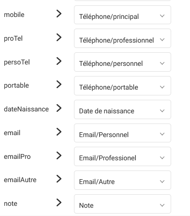

# ZimbraToInfomaniak

Little script written in order to help me migrate my contacts from Zimbra (hosted by [Yulpa.io](https://yulpa.io/)) to the _Contacts_ part of [Infomaniak's Email Service](https://www.infomaniak.com/en/hosting/service-mail/).

## Guide

### Setting-up the project

Checkout the project then open a terminal in the sub-project's directory and type the following command to download the dependencies :

```bash
X:\...\atoutscript\zimbraToInfomaniak> npm install
```

### Exporting contacts from Zimbra

Connected on Zimbra, choose _Preferences_ tab then _Import / Export_ menu in the left sidebar.

Under _Export_, select **Type:** _Contacts_ and _Outlook 2003 Contacts_.


Pick the right _Source_ and validate by clicking on _Export_.

Save the _.csv_ file as _Contacts.csv_ in _.../atoutscript/zimbraToInfomaniak/in_ by overwriting the existing one provided as example.

### Launching the script

In the terminal previously openned, still in the sub-project's directory, launch the script with the following command : 

```bash
X:\...\atoutscript\zimbraToInfomaniak> node index.js
```

You should soon see the result :

```bash
Starting process for  ./in/Contacts.csv
Done.
See :  ./out/zimbraToInfoResult.csv
```

As displayed, the result is available at _.../atoutscript/zimbraToInfomaniak/out/zimbraToInfoResult.csv_

### Importing on Infomaniak

Open [Contacts](https://contacts.infomaniak.com/), fill your credentials if necessary then in the left sidebar click on _Import_.

Browse your computer or drag&drop the _.../atoutscript/zimbraToInfomaniak/out/zimbraToInfoResult.csv_ file.

Leave the separator as _Comma_ and pick _Yes_ for _Headers_ then click on _Next_.

Affect the columns as shown below : 

#### First part


#### Second part


Click _Next_.

Pick the right _Folder_[1] and finally _Launch the import_.

_Voilà_.

### Final note

The resulting file contains a _dummy_ row to ease the columns affectation on Infomaniak's tool. It will result in importing a contact called _nom prenom_.

Don't forget to delete it from your folder.

## Disclaimer

It has been developed in order to fill the needs I had for the process. It's not at all generic since there's no parameters. 

But the code has been made in order to be easily tweaked to anyone's needs.

---

[1]: It's best to create a new folder here and import the contacts in it, in order to avoid messing with existing contacts. Once the import is successfull and the result manually checked, move the contacts from the new folder with the UI.
